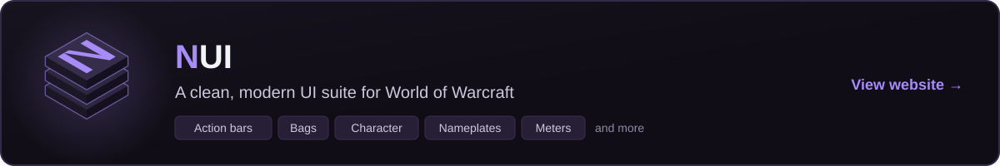
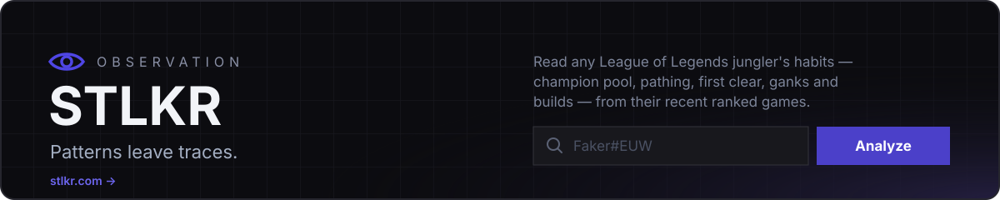
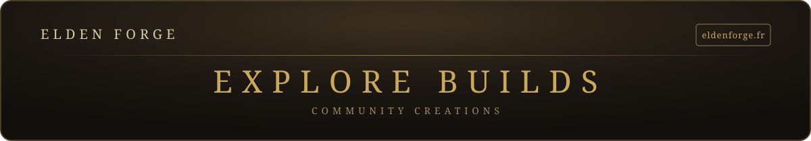

# Hey, I'm Louis

Full-stack dev working mostly with **C# / .NET** and **Python**. 3 years in the .NET ecosystem.

On the side, I build game tools and small projects: a WoW UI suite, a League of Legends scouting tool and an Elden Ring build platform.

### Projects

### Languages

  
  
  
  
  
  

### Frameworks & tools

  
  
  
  
  

### Databases

  
  
  
  

### Like my work?

  
  

